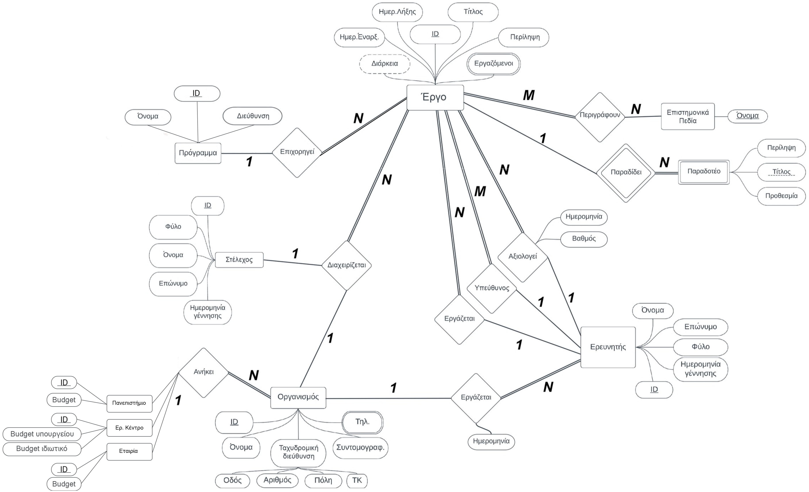
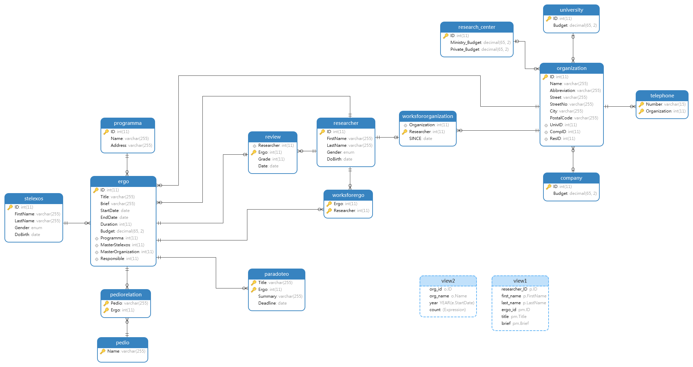

|  Όνομα      |    Χαράλαμπος             |      Γεώργιος-Λουκάς        |      Γεώργιος                |
|-------------|---------------------------|-----------------------------|------------------------------|
|  Επίθετο    |    Μπεκιάρης              |      Υγρόπουλος             |      Μπελιώτης               |
|  Σχολή      |    ΕΜΦΕ                   |      ΕΜΦΕ                   |      ΗΜΜΥ                    |
|  Αριθμός    |    ge18088                |      ge18801                |      el19139                 |
|  Μητρώου    |                           |                             |                              |
|  email      |    ge18088@mail.ntua.gr   |      ge18801@mail.ntua.gr   |      georgebel@hotmail.gr    |
|  Εξάμηνο    |    $8^{\text{ο}}$         |       $8^{\text{ο}}$        |        $6^{\text{ο}}$        | 


<!-- TOC start -->
- [Προαπαιτούμενα της εφαρμογής](#προαπαιτούμενα-της-εφαρμογής)
  * [Εγκατάσταση της βάσης σε περιβάλλον linux μέσω docker](#εγκατάσταση-της-βάσης-σε-περιβάλλον-linux-μέσω-docker)
- [Εγκατάσταση της εφαρμογής](#εγκατάσταση-της-εφαρμογής)
  * [Εισαγωγή του ddl αρχείου](#εισαγωγή-του-ddl-αρχείου)
  * [Εισαγωγή του dml αρχείου](#εισαγωγή-του-dml-αρχείου)
  * [Τρέχοντας τον web server](#τρέχοντας-τον-web-server)
  * [Triggers](#triggers)
  * [Όψεις του σχεσιακού μοντέλου](#όψεις-του-σχεσιακού-μοντέλου)
- [Παράρτημα](#παράρτημα)
  * [Δημιουργία ddl αρχείου](#δημιουργία-ddl-αρχείου)
  * [Δημιουργία dml αρχείου](#δημιουργία-dml-αρχείου)
  * [Εισάγετε τυχαία δεδομένα με το script μας](#εισάγετε-τυχαία-δεδομένα-με-το-script-μας)

<!-- TOC end -->
# Προαπαιτούμενα της εφαρμογής

Για να τρέξετε την εφαρμογή, θα χρειαστείτε να έχετε εγκατεστημένα στο
σύστημά σας:

-   Μία βάση δεδομένων Mariadb.

-   Έναν dbms client, εμείς επιλέξαμε το phpmyadmin.

Για το server-side της εφαρμογής, επιλέξαμε να χρησιμοποιήσουμε το
πακέτο flask της python, ενώ για την σύνδεση της βάσης με την python, το
πακέτο flask-mysqldb.

Εάν δεν έχετε κάποιο από τα παραπάνω υπάρχουν σχετικές οδηγίες παρακάτω.

## Εγκατάσταση της βάσης σε περιβάλλον linux μέσω docker

Αρχικά πρέπει να εγκατασταθεί το docker στο σύστημά σας, επομένως
ανάλογα την διανομή ακολουθείτε τις οδηγίες που βρίσκονται στην επίσημη
ιστοσελίδα του docker, κάνοντας κλικ
[εδώ](https://docs.docker.com/engine/install/). Εν συνεχεία, αν δεν
τρέχει ήδη το docker, πληκτρολογήστε την εντολή:

``` {.bash breaklines="true"}
> sudo systemctl start docker
```

Για να εγκαταστήσετε την τελευταία διαθέσιμη έκδοση του Mariadb στο
docker, θα πρέπει να τρέξετε την ακόλουθη εντολή:

``` {.bash breaklines="true"}
> sudo docker run --name ntua-mariadb -d -e  MYSQL_ROOT_PASSWORD=examplepass mariadb
```

Η παραπάνω εντολή θα εγκαταστήσει το ζητούμενο σε ένα container με το
όνομα ntua-mariadb, και ως κωδικό της βάσης examplepass. Φυσικά μπορείτε
να χρησιμοποιήσετε ότι κωδικό θέλετε ή να ονομάσετε όπως αλλιώς θέλετε
το container. Κατά σύμβαση από εδώ και στο εξής οτιδήποτε σχετικό με το
Mariadb, όπως ο κωδικός, και το όνομα του εν λόγω container θα γίνονται
οι αναφορές όπως είναι στην παραπάνω εντολή.

Ακολούθως, πρέπει να εγκατασταθεί το phpmyadmin:

``` {.bash breaklines="true"}
> sudo docker run --name ntua-phpmyadmin -d -p 8080:80  -e PMA_HOST=ntua-mariadb phpmyadmin
```

Στην παραπάνω εντολή το phpmyadmin θα εγκατασταθεί σε ένα container
ονόματι ntua-phpmyadmin. Δίνουμε ως argument στην παραπάνω εντολή το
όνομα του container στο οποίο τρέχει το Mariadb.

Τέλος, προκειμένου να επικοινωνούν σωστά τα παραπάνω container, και να
μπορεί ο χρήστης να αλληλεπιδράσει με αυτά θα πρέπει να δημιουργηθεί στο
docker ένα network στο οποία θα συνδεθούν τα containers:

``` {.bash numbers="right" fontsize="\\small" breaklines="true"}
> sudo docker network create ntua-network
> sudo docker network connect ntua-network ntua-mariadb
> sudo docker network connect ntua-network ntua-phpmyadmin
```

Το δίκτυο που δημιουργείται με τις παραπάνω εντολές έχει όνομα
ntua-network.

Για να δείτε εάν τρέχουν τα container τρέξτε την παρακάτω εντολή:

``` {.bash breaklines="true"}
> sudo docker ps -a
```

Εάν δεν τρέχουν τότε μπορείτε να τα εκκινήσετε τρέχοντας την παρακάτω
εντολή:

``` {.bash breaklines="true"}
> sudo docker start ntua-mariadb
> sudo docker start ntua-phpmyadmin
```

To phpmyadmin είναι προσβάσιμο από την διεύθυνση localhost:8080 και θα
σας ζητηθούν τα στοιχεία για την σύνδεση στην βάση:

``` {.bash breaklines="true"}
username: root
password: examplepass
```

## Εγκατάσταση των πακέτων της python

Η εφαρμογή μας και τα πακέτα που χρειάζεται, τρέχουν στην python3, η
οποία βρίσκεται προεγκατεστημένη στις περισσότερες σύγχρονες διανομές
του linux, όπως το Fedora. Tα πακέτα της Python που θα χρειαστείτε
μπορείτε να τα αποκτήσετε μέσω pip:

``` {.bash breaklines="true"}
> pip install flask flask_mysqldb
```

Αν δεν έχετε το pip διαθέσιμο στον υπολογιστή σας συμβουλευτείτε τις
οδηγίες της διανομής σας για να αποκτήσετε την έκδοση που είναι συμβατή
με την python3.

# Εγκατάσταση της εφαρμογής

Ανοίξτε το phpmyadmin και κατεβάστε από το github repo
(<https://github.com/J0K3RAS/project92_db_2022>) τα αρχεία ddl και dml.
Σιγουρευτείτε ότι βρίσκεστε στην αρχική σελίδα του phpmyadmin (home )
και πως δεν υπάρχει άλλη βάση με το όνομα project92.

## Εισαγωγή του ddl αρχείου

Το αρχείο ddl θα δημιουργήσει μια νέα βάση με το όνομα project92, και θα
ορίσει όλους τους πίνακες (entities & relations) της βάσης, καθώς και τα
views. Ακολουθώντας τα παρακάτω βήματα μπορείτε να εισάγεται το εν λόγω
αρχείο στην βάση:


-   Από την αρχική σελίδα του phpmyadmin επιλέξτε το κουμπί **Import** στο
πάνω menu.


Στην σελίδα που μας ανοίγει, πρέπει να επιλέξετε για import κάποιο από 
τα διαθέσιμα στον υπολογιστή σας. Πατήστε Choose Files και επιλέξτε το 
ddl αρχείο μας, project92_ddl.sql. Οι υπόλοιπες επιλογές μπορούν να
μείνουν ως έχουν, δηλαδή: 


 -    Allow the interruption of an import in case the script detects it is ..
      close to the PHP timeout limit.

 -    Enable foreign key checks 

 -    Do not use AUTO_INCREMENT for zero values

 -    Skip this number of queries (for SQL) starting from the first one: 0

 -    Format: SQL

 -    SQL Compatibility mode: NONE


Τέλος πατήστε το κουμπί **Go** στο κάτω δεξιά μέρος της σελίδας. Αν όλα
πάνε καλά ευχάριστα μηνύματα επιτυχίας θα γεμίσουν την οθόνη σας και θα
μπορείτε να δείτε την βάση μας στο αριστερό menu του phpmyadmin.

> Σε περίπτωση που αποτύχει η παραπάνω διαδικασία λόγω των foreign key checks, κάντε drop την βάση και δοκιμάστε πάλι χωρίς να επιλέξετε το κουτάκι Enable foreign key checks.

## Εισαγωγή του dml αρχείου

Στην συνέχεια, θα πρέπει να εισάγετε δεδομένα στην βάση, μέσω του dml
script. Επαναλάβετε τα ίδια βήματα που ακολουθήσατε στην προηγούμενη
ενότητα για το ddl script, όμως αυτή την φορά επιλέξτε το αρχείο
project92_dml.sql.

## Τρέχοντας τον web server

Στο github repo της ομάδας μας, θα βρείτε τον φάκελο web_server μέσα
στον οποίο υπάρχει το αρχείο app.py και μπορείτε να το τρέξετε
ανοίγοντας ένα τερματικό στον εν λόγω φάκελο και πληκτρολογώντας την
εντολή:

``` {.bash breaklines="true"}
> flask run
```

Απαραίτητη προϋπόθεση για να συνδεθεί σωστά το flask με την βάση, είναι
στις πρώτες γραμμές του αρχείου app.py να ορίσετε σωστά την διεύθυνση
και την θύρα στην οποία τρέχει η βάση, το username, τον κωδικό και το
όνομα της βάσης. Ενδεικτικά, με βάση όσα αναφέρθηκαν στις προηγούμενες
ενότητες το σωστό configuration θα ήταν:

``` {.python breaklines="true"}
app.config['MYSQL_HOST'] = '172.18.0.2' 
app.config['MYSQL_PORT'] = 3306 
app.config["MYSQL_USER"] = "root" 
app.config["MYSQL_PASSWORD"] = "examplepass" 
app.config["MYSQL_DB"] = "project92"
```

Σε ένα σύστημα που τρέχει windows και η Mariadb είναι εγκατεστημένη μέσω
XAMPP, τότε το επιθυμητό configuration είναι:

``` {.python breaklines="true"}
app.config['MYSQL_HOST'] = 'localhost' 
app.config['MYSQL_PORT'] = 3306 
app.config["MYSQL_USER"] = "root" 
app.config["MYSQL_PASSWORD"] = "" 
app.config["MYSQL_DB"] = "project92"
```

Αν όλα πάνε καλά, ανοίγωντας στον browser διεύθυνση
[127.0.0.1:5000](http://127.0.0.1:5000) θα δείτε την αρχική σελίδα της
εφαρμογής μας, και επιλέγοντας από το αριστερό μενού το ερώτημα που
θέλετε, θα ανακτήσετε τις πληροφορίες που θέλετε από την βάση με ένα
φιλικό προς τον χρήστη τρόπο.

# Επισκόπηση της βάσης

## Τελικό ER diagram

Προκειμένου η βάση μας να είναι λειτουργική και να ικανοποιεί όλα τα
ζητήματα, θα πρέπει σε conceptual επίπεδο να φτιαχτεί ένα διάγραμμα που
να περιγράφει τις βασικές οντότητες της βάσης μας, τα attributes των
οντοτήτων, και τις σχέσεις που περιγράφουν τις μεταξύ τους
αλληλεπιδράσεις. Το διάγραμμα αυτό καλέιται Entity Relationship diagram
και για την βάση μας μπορείτε να το δείτε παρακάτω. Υπάρχουν κάποιες
διαφοροποιήσεις σε σχέση με το αρχικό που είχαμε υποβάλλει, καθώς,
εμπλουτίσαμε το δικό μας σε κάποια σημεία με το προτεινόμενο ER που είχε
αναρτηθεί.



## Σχεσιακό Διάγραμμα

Στο σχεσιακό διάγραμμα μπορείτε να δείτε πως υλοποιήσαμε το ER στην βάση
μας. Το εν λόγω διάγραμμα περιέχει τους πίνακες που ορίσαμε με τις
αντίστοιχες κολώνες τους, καθώς και τις σχέσεις μεταξύ των πινάκων.



Όπως μπορείτε να δείτε οι πίνακες είναι παραπάνω από τα Entities στο ER
diagram. Αυτο οφείλεται στο γεγονός ότι τα Many-to-Many relationships
για την υλοποίηση τους χρειάζονται ένα ξεχωριστό entity, επομένως ήταν
αναγκαία η δημιουργία των πινάκων WorksForOrganization, WorksForErgo και
PedioRelation. Επίσης, καθώς η mariadb δεν υποστηρίζει multivalued
attributes ένας νέος πίνακας για τα τηλέφωνα των οργανισμών έπρεπε να
κατασκευαστεί. Τέλος, η σχέση της αξιολόγησης, καθώς έχει attributes τον
βαθμό και την ημερομηνία, επίσης έγινε ένας ξεχωριστός πίνακας.

## Πίνακες

Εν συνεχεία, παραθέτουμε του κώδικες με τους οποίους κατασκευάστηκαν οι
παραπάνω πίνακες:

-   Στέλεχος ΕΛΛΙΔΕΚ

    ``` {.sql breaklines="true"}
    CREATE TABLE Stelexos(
        ID int NOT NULL AUTO_INCREMENT,
        FirstName varchar(255),
        LastName varchar(255),
        Gender ENUM('Male', 'Female'),
        DoBirth DATE,
        PRIMARY KEY (ID)
    );
    ```

-   Ερευνητής

    ``` {.sql breaklines="true"}
    CREATE TABLE Researcher(
        ID int NOT NULL AUTO_INCREMENT,
        FirstName varchar(255),
        LastName varchar(255),
        Gender ENUM('Male', 'Female'),
        DoBirth DATE,
        PRIMARY KEY (ID)
    );
    ```

-   Πεδίο

    ``` {.sql breaklines="true"}
    CREATE TABLE Pedio (
         Name varchar(255),
         PRIMARY KEY (Name)
    );
    ```

-   Σχέση πεδίων με τα έργα

    ``` {.sql breaklines="true"}
    CREATE TABLE PedioRelation(
        Pedio varchar(255) NOT NULL,
        Ergo int NOT NULL,
        FOREIGN KEY (Pedio) REFERENCES Pedio(Name) ON UPDATE CASCADE ON DELETE CASCADE,
        FOREIGN KEY (Ergo) REFERENCES Ergo(ID) ON DELETE CASCADE,
        PRIMARY KEY (Pedio,Ergo)
    );
    ```

-   Πρόγραμμα του ΕΛΛΙΔΕΚ

    ``` {.sql breaklines="true"}
    CREATE TABLE Programma(
        ID int NOT NULL AUTO_INCREMENT,
         Name varchar(255),
        Address varchar(255),
        PRIMARY KEY (ID)
    );
    ```

-   Έργο

    ``` {.sql breaklines="true"}
    CREATE TABLE Ergo(
        ID INT NOT NULL AUTO_INCREMENT,
        Title varchar(255),
        Brief varchar(255),
        StartDate DATE NOT NULL,
        EndDate DATE NOT NULL,
        Duration int AS (YEAR(EndDate)-YEAR(StartDate)) CHECK (Duration<=4 AND Duration>=1),
        Budget DECIMAL(65,2) CHECK (Budget>=0),
        Programma int NOT NULL,     
        MasterStelexos int NOT NULL,
        MasterOrganization int NOT NULL,
        Responsible int NOT NULL,
        FOREIGN KEY (Programma) REFERENCES Programma(ID),
        FOREIGN KEY (MasterStelexos) REFERENCES Stelexos(ID),
        FOREIGN KEY (MasterOrganization) REFERENCES Organization(ID),
        FOREIGN KEY (Responsible) REFERENCES Researcher(ID),
        PRIMARY KEY (ID)
    );
    ```

-   Παραδοτέο

    ``` {.sql breaklines="true"}
    CREATE TABLE Paradoteo(
        Title varchar(255) NOT NULL,
        Ergo int NOT NULL,
        Summary varchar(255),
        Deadline DATE,
        FOREIGN KEY (Ergo) REFERENCES Ergo(ID) ON DELETE CASCADE,
        PRIMARY KEY (Title,Ergo)
    ); 
    ```

-   Αξιολόγηση

    ``` {.sql breaklines="true"}
    CREATE TABLE Review(
        Researcher INT NOT NULL,
        Ergo INT NOT NULL,
        Grade int NOT NULL,
        Date DATE NOT NULL,
        FOREIGN KEY (Researcher) REFERENCES Researcher(ID) ON DELETE NO ACTION,
        FOREIGN KEY (Ergo) REFERENCES Ergo(ID) ON DELETE CASCADE,
        PRIMARY KEY (Ergo)
    );
    ```

-   Ερενευτής εργάζεται σε έργο

    ``` {.sql breaklines="true"}
    CREATE TABLE WorksForErgo(
        Ergo int,
        Researcher int,
        FOREIGN KEY (Ergo) REFERENCES Ergo(ID) ON DELETE CASCADE,
        FOREIGN KEY (Researcher) REFERENCES Researcher(ID) ON DELETE CASCADE,
        PRIMARY KEY (Ergo,Researcher)
    );
    ```

-   Ερευνητής εργάζεται σε οργανισμό

    ``` {.sql breaklines="true"}
    CREATE TABLE WorksForOrganization(
        Organization int NOT NULL,
        Researcher int NOT NULL,
        SINCE DATE NOT NULL,
        FOREIGN KEY (Organization) REFERENCES Organization(ID) ON DELETE CASCADE,
        FOREIGN KEY (Researcher) REFERENCES Researcher(ID) ON DELETE CASCADE,
        PRIMARY KEY (Researcher)
    );
    ```

-   Οργανισμός

    ``` {.sql breaklines="true"}
    CREATE TABLE Organization(
        ID INT NOT NULL AUTO_INCREMENT,
        Name varchar(255),
        Abbreviation varchar(255),
        Street varchar(255),
        StreetNo varchar(255),
        City varchar(255),
        PostalCode varchar(255),
        UnivID int,
        CompID int,
        ResID int,
        CONSTRAINT chk
          CHECK( (UnivID IS NULL AND CompID IS NULL AND ResID IS NOT NULL) OR
                 (UnivID IS NULL AND CompID IS NOT NULL AND ResID IS NULL) OR
                 (UnivID IS NOT NULL AND CompID IS NULL AND ResID IS NULL)),
        PRIMARY KEY (ID),
        FOREIGN KEY (UnivID) REFERENCES University(ID),
        FOREIGN KEY (CompID) REFERENCES Company(ID),
        FOREIGN KEY (ResID) REFERENCES Research_Center(ID)
    );
    ```

-   Τηλέφωνο

    ``` {.sql breaklines="true"}
    CREATE TABLE Telephone(
        Number varchar(15) NOT NULL,
        Organization int NOT NULL,
        FOREIGN KEY (Organization) REFERENCES Organization(ID) ON DELETE CASCADE,
        PRIMARY KEY (Organization,Number)
    );
    ```

-   Εταιρία

    ``` {.sql breaklines="true"}
    CREATE TABLE Company(
        ID int NOT NULL AUTO_INCREMENT,
        Budget DECIMAL(65,2) CHECK (Budget>=0),
        PRIMARY KEY (ID)
    );
    ```

-   Πανεπιστήμιο

    ``` {.sql breaklines="true"}
    CREATE TABLE University(
        ID int NOT NULL AUTO_INCREMENT,
        Budget DECIMAL(65,2) CHECK (Budget>=0),
        PRIMARY KEY (ID)
    );
    ```

-   Ερευνητικό κέντρο

    ``` {.sql breaklines="true"}
    CREATE TABLE Research_Center(
        ID int NOT NULL AUTO_INCREMENT,
        Ministry_Budget DECIMAL(65,2) CHECK (Ministry_Budget>=0),
        Private_Budget DECIMAL(65,2) CHECK (Private_Budget>=0),
        PRIMARY KEY (ID)
    );
    ```

## Παραδοχές

Όπου χρειάζεται υπολογισμός χρονικής διάρκειας σε κλίμακα ετών,
αφαιρούμε απλώς τα έτη από τις δύο ημερομηνίες. Για παράδειγμα, η
διάρκεια ενός έργου υπολογίζεται ως έτος_λήξης - έτος_εκκίνησης.

-   Οργανισμοί:

    -   Οι οργανισμού αρχικά δημιουργούνται χωρίς να έχουν τηλέφωνα. Αν
        το insert γινόταν μέσω του UI θα είχαμε στην ίδια φόρμα ένα
        πεδίο για το τηλέφωνο το οποίο θα ήταν υποχρεωτικό να
        συμπληρωθεί.

    -   Διαγράφοντας έναν οργανισμό, διαγράφονται επίσης τα τηλέφωνά του
        και οι αντίστοιχες γραμμές του πίνακα WorksForOrganization που
        αφορούν τον αντίστοιχο οργανισμό. Ο οργανισμός δεν μπορεί να
        διαγραφτεί στην περίπτωση που διαχειρίζεται κάποιο έργο.

-   Ερευνητές:

    -   Διαγράφοντας τον ερευνητή, διαγράφονται επίσης οι αντίστοιχες
        γραμμές του WorksForErgo και του WorksForOrganization. Ο
        ερευνητής δεν επιτρέπεται να διαγραφτεί την περίπτωση που έχει
        γράψει αξιολόγηση για κάποιο έργο, είτε είναι υπεύθυνος σε
        κάποιο έργο.

-   Στελέχη:

    -   Τα στελέχη, όμοια με τους ερευνητές, δεν μπορούν να διαγραφτούν
        σε περίπτωση που διαχειρίζονται κάποιο έργο.

-   Έργα:

    -   Τα έργα αρχικά δημιουργούνται χωρίς να έχουν αξιολόγηση, ενώ το
        κάθε έργο πρέπει να έχει μία αξιολόγηση. Επομένως αν έπρεπε να
        γίνουν οι εισαγωγές των έργων μέσω του UI, τότε στην ίδια φόρμα
        με τα έργα θα έπρεπε ταυτόχρονα ο χρήστης να συμπληρώνει τα
        στοιχεία της αξιολόγησης για να δημιουργηθεί το έργο.

    -   Διαγράφοντας τα έργα, διαγράφονται επίσης τα παραδοτέα τους, οι
        σχέσεις με τα πεδία pediorelation και τους ερευνητές
        WorksForErgo, και η αντίστοιχη αξιολόγηση.

## Ευρετήρια

Από μόνη της η Mariadb όταν δημιουργούμε ένα νέο πίνακα, φτιάχνει
indexes πάνω στο primary key και επίσης υπάρχουν ήδη ευρετήρια στα τυχόν
foreign key τα οποία κάνουν reference το primary key κάποιου άλλου
πίνακα. Έτσι όπως είναι φτιαγμένα τα primary keys, για τα ερωτήματα που
πρέπει να απαντηθούν στο 3ο σκέλος της εκφώνησης, είναι αρκετά τα εν
λόγω ευρετήρια. Παρόλα αυτά, επειδή σε κάποια ερωτήματα θέλουμε μόνο τα
ενεργά έργα, παραθέτουμε ενδεικτικά ένα ευρετήριο το οποίο κατασκευάσαμε
πάνω στην κολώνα EndDate του πίνακα Ergo.

``` {.sql breaklines="true"}
CREATE INDEX end_date ON Ergo (EndDate);
```

## Triggers

Γνωρίζουμε πως δεν γίνεται ο αξιολογητής του έργου να εργάζεται στον
οργανισμό που το διαχειρίζεται. Γι' αυτό δημιουργήσαμε ένα trigger πριν
γίνει insert η αξιολόγηση, ώστε σε περίπτωση που ο αξιολογητής εργάζεται
στον οργανισμό που επιβλέπει το έργο, τότε δεν γίνεται το insert και η
βάση μας πετάει exception με σχετικό μήνυμα.

``` {.sql breaklines="true"}
DELIMITER //
CREATE TRIGGER
    test
BEFORE INSERT ON Review FOR EACH ROW
BEGIN
  IF( 
    (SELECT e.MasterOrganization AS `Organization` FROM Ergo e WHERE e.ID=NEW.Ergo) =
    (SELECT w.Organization FROM WorksForOrganization w WHERE w.Researcher=NEW.Researcher)
 ) 
THEN
    signal sqlstate '45000' set message_text = "Reviewer works for organization that manages `Ergo`";
  END IF;
END; //
DELIMITER ;
```

## Όψεις του σχεσιακού μοντέλου

Σύμφωνα με την εκφώνηση, ορίζουμε το πρώτο view του σχεσιακού μοντέλου
και κρατάμε τις στήλες οι οποίες θεωρούμε ότι μπορεί να είναι χρήσιμες,
όπως το id, το όνομα, και το επίθετο του ερευνητή, καθώς και το id του
έργου, τον τίτλο του και την περίληψή του.

``` {.sql breaklines="true"}
CREATE VIEW view1 AS SELECT
    p.ID AS researcher_ID,
    p.FirstName AS first_name,
    p.LastName AS last_name,
    pm.ID as ergo_id,
    pm.Title as title,
    pm.Brief as brief
FROM
    WorksForErgo w
    INNER JOIN Researcher p ON w.Researcher=p.ID
    INNER JOIN Ergo pm ON w.Ergo=pm.ID;
```

Ως δεύτερη όψη του σχεσιακού μοντέλου επιλέξαμε να εμφανίζεται το πλήθος
των έργων που λαμβάνει ο κάθε οργανισμός ανά έτος.

``` {.sql breaklines="true"}
CREATE VIEW view2 AS SELECT
    o.ID as `org_id`,
    o.Name as `org_name`,
    YEAR(e.StartDate) as `year`,
    COUNT(CONCAT(o.ID,",",e.StartDate)) as `count`
FROM
    Ergo e
    JOIN Organization o ON e.MasterOrganization=o.ID 
GROUP BY
    `org_id`,`year`;
```

# Παράρτημα

## Δημιουργία ddl αρχείου

Με την βοήθεια της εντολής mysqldump μπορούμε να πάρουμε το ddl αρχείο
της βάσης, ανοίγοντας ένα τερματικό και πληκτρολογώντας την ακόλουθη
εντολή:

``` {.bash breaklines="true"}
> mysqldump --databases project92 -u root -h 172.18.0.2 --port=3306 -p  --no-data > project92_ddl.sql 
```

Φυσικά, στην παραπάνω εντολή χρειάζεται να δώσουμε το όνομα της βάσης
project92, το όνομα χρήστη root, την διεύθυνση που τρέχει η βάση .0.2,
και την θύρα . Θα δημιουργηθεί ένα νέο αρχείο project92_ddl.sql στο
working directory που ανοίξατε το τερματικό.

Εάν έχετε κωδικό στην βάση σας, τότε θα σας ζητηθεί να τον
πληκτρολογήσετε.

## Δημιουργία dml αρχείου

Όμοια με το ddl, πληκτρολογούμε στο τερματικό:

``` {.bash breaklines="true"}
> mysqldump --databases project92 -u root -h 172.18.0.2 --port=3306 -p  --no-create-db --no-create-info --skip-triggers > project92_dml.sql
```

Θα δημιουργηθεί ένα νέο αρχείο με το όνομα project92_dml.sql.

## Εισάγετε τυχαία δεδομένα με το script μας

Μπορείτε αντί του dml script να δοκιμάσετε να εισάγετε στην βάση τυχαία
δεδομένα, με το script το οποίο φτιάξαμε για γεμίσουμε τους πίνακες με
δεδομένα και να ορίσουμε (σχεδόν) τυχαία σχέσεις μεταξύ των
αντικειμένων, λαμβάνοντας υπόψιν φυσικά τους περιορισμούς που
προαναφέρονται παραπάνω. Θα βρείτε στον φάκελο fake_data στο repo μας,
το αρχείο main.py.

-   Ανοίξτε το και ρυθμίστε το ώστε να συνδεθεί με την βάση σας
    αλλάζοντας τις πρώτες γραμμές (16-20). Ενδεικτικά οι ρυθμίσεις με
    βάση την ενότητα 1, είναι:

``` {.python numbers="left" breaklines="true" startFrom="16"}
        user="root",
        password="2223041042",
        host="172.18.0.2",
        port=3306,
        database="project92"
```

-   Σιγουρευτείτε πως η βάση σας είναι πλήρως κενή πριν το τρέξετε. Θα
    πρέπει να έχετε εγκατεστημένα στο σύστημά σας τις βιβλιοθήκες της
    python pandas, numpy, faker & mariadb.
